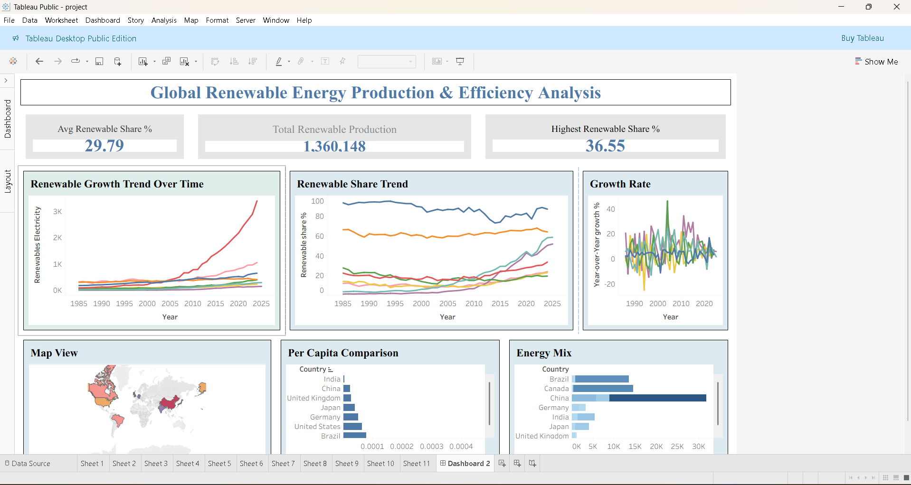

# Global-Renewable-Energy-Dashboard-Tableau-
# 🌍 Global Renewable Energy Dashboard (Tableau)

## 🧠 Project Overview

This project presents an interactive Tableau dashboard analyzing global renewable energy production across multiple countries and years.  
The dashboard provides insights into energy generation trends, renewable energy share, and regional performance to support sustainability analysis and policy planning.

---

## 🎯 Objectives

- Analyze renewable energy production trends over time
- Compare energy generation across countries
- Evaluate renewable energy share in total energy mix
- Identify leading countries in clean energy adoption
- Provide interactive visual exploration of global data

---

## 🛠️ Tools & Technologies Used

- Tableau Desktop
- Data Visualization Techniques
- Geographic Mapping
- Interactive Filters & Dashboards
- Data Analysis

---

## 📊 Dashboard Features

✔ Interactive visualizations  
✔ Country-wise renewable energy production  
✔ Time-series analysis of energy trends  
✔ Geographic map visualization  
✔ Filters for dynamic exploration  
✔ Comparative analysis across regions  

---

## 📈 Key Insights

- Identified top countries leading in renewable energy production
- Observed growth trends in clean energy adoption over time
- Compared regional contributions to global renewable output
- Highlighted countries with rapid sustainability progress

---

## 🌐 Data Source

Publicly available global renewable energy datasets (e.g., government or international energy statistics).

---

## 📷 Dashboard Preview

> Add your dashboard screenshot here

---

## 📂 Files Included

- `Global_Renewable_Energy_Dashboard.twbx` — Tableau packaged workbook  
- `dataset.xlsx` — Source data (if included)  
- `dashboard.png` — Dashboard screenshot  

---

## 🚀 How to Use

1. Download the `.twbx` file  
2. Open using **Tableau Desktop / Tableau Reader**  
3. Interact with filters and visualizations  

---

## 💡 Use Cases

- Sustainability analysis
- Energy policy planning
- Environmental research
- Educational purposes
- Data visualization practice

---

## 👨‍💻 Author

**Sahil Lendhe**  
Aspiring Data Analyst | AI/ML Engineer  

📧 sahillendhe2004@gmail.com  
🔗 LinkedIn: https://www.linkedin.com/in/sahil-lendhe-671b5930b  
💻 GitHub: https://github.com/sahil1000725  

---

⭐ If you found this project useful, consider giving it a star!
